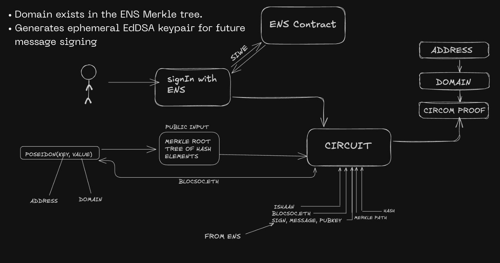
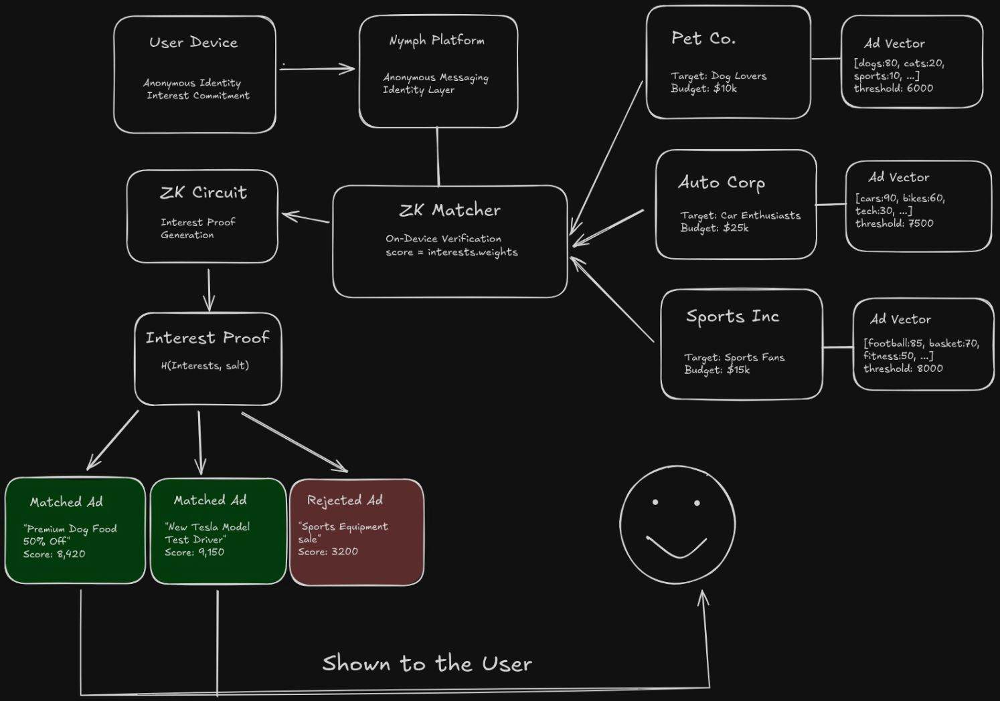

# Nymph - Anonymous Web3 Social Platform

Nymph is a revolutionary Web3 platform that enables anonymous communication within organizations while maintaining trust and authenticity through blockchain technology. Not just mobile friendly, it also leverages zk proofs, ENS domains, and on-chain randomness to create a truly private yet verifiable social experience.

## 🎯 Problem Statement

People inside organizations often cannot speak freely about internal issues and culture due to fear of being identified or penalized. Existing anonymous platforms suffer from:

- **Spam and fake members** - No verification of organizational membership
- **Data collection concerns** - Platforms collect personal data/emails, compromising anonymity

## 💡 Our Solution

### Core Features

#### 🔐 **SIWE Authentication with ZK Proofs**
- Users authenticate via **Sign-In With Ethereum (ERC-4361)** using their wallet
- Generate **zk proofs** to verify organizational membership without revealing identity using the ENS of the user. 
- Post anonymously as eg. "Someone from blocsoc.eth says..."



#### 🍪 **zkCookies - Privacy-Preserving Interest Tracking (POC)**
- **Learning without tracking** - AI classifies content interests locally
- Generate **cryptographic proofs** of interest updates without revealing exact preferences
- **Interest-based reputation** system highlighting anonymous topic contributors
- Users control their data and can prove interest levels for targeted content



### Platform Structure

#### 📱 **Dual Feed System**
- **Public Feed** - Open community discussions and research papers
- **Private Feed** - Organization-specific anonymous channels

#### 🔬 **Research Integration**
- Curated research papers from platforms like ethresear.ch
- Anonymous peer review and discussion
- Upvoting/downvoting with ZK-verified organizational membership

### Prerequisites
- Node.js (v18 or higher)
- npm or yarn
- Expo CLI
- iOS Simulator or Android Emulator

### Installation Steps

1. **Clone the repository**
```bash
git clone <https://github.com/ishaanxcoder/nymph>
cd nymph
```

2. **Install dependencies**
   ```bash
   npm install
   ```

3. **Configure environment variables**
Create a `.env` file with:
```env
EXPO_PUBLIC_RPC_URL=your-ethereum-rpc-url
EXPO_PUBLIC_PRIVATE_KEY=your-private-key
EXPO_PUBLIC_COINFLIP_ADDRESS=your-colorflip-contract-address
EXPO_PUBLIC_ENTROPY_ADDRESS=your-entropy-contract-address
```

4. **Start the development server**
   ```bash
   npx expo start
   ```

5. **Run on device/simulator**
- Press `i` for iOS simulator
- Press `a` for Android emulator
- Scan QR code with Expo Go app for physical device


## 📄 License

This project is licensed under the MIT License - see the LICENSE file for details.

## 🤝 Contributing

We welcome contributions! Please see our contributing guidelines and code of conduct.

## 📞 Contact

For questions, suggestions, or collaboration opportunities, please reach out to the team:
- **Ajay Odedra**
- **Anand Bansal** 
- **Ishaan Kesarwani**
- **Sambhav Jain**
- **Utsav Sharma**

---